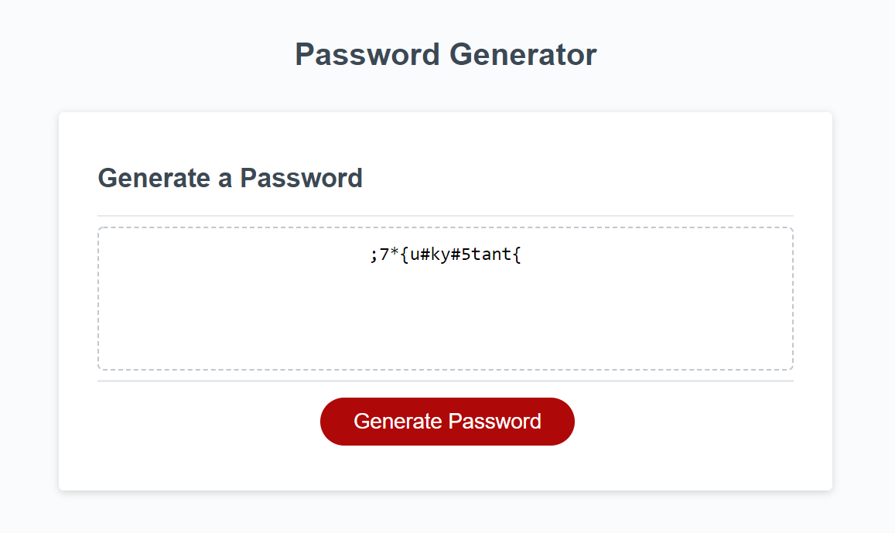

# Password-Generator

## Description

This is a password generator tool that can help generate a unique password. The complexity of the password can vary based on criteria the user chooses.

It is common practice for any website user interface to store usernames and passwords to tailor content and profiles to every user's needs. This also 
adds a necessity of security for these users as some websites may store more personal information that, in the wrong hands, could be used maliciously.

For that reason, it is important to keep passwords unique, but also not easy to guess by hackers. With this application, users can generate unique and 
complex passwords that they can then store in a password manager for later use.

## Table of Contents

- [Development](#development)
- [Installation](#installation)
- [Usage](#usage)
- [Credits](#credits)
- [License](#license)

## Development

1. I first needed to define all the arrays the password would be pulling out of. This would be letters, numbers, and special characters.
2. I then had to create the prompts for the generate password function that would ask the user password length, uppercase and lowercase letters, numbers, 
and special characters.
3. A check was created for the amount of characters in the password to ensure it was at least 8 characters long, and no longer than 128 characters long.
4. If statements with nested for loops, in certain cases, were used to validate if the user had selected criteria for certain character types in the password. 
True statements were then added to an intialized blank array, and if the array had already been added to, then the data was added to the array via the concat 
method.
5. A validation check is then run to make sure at least one set of criteria was added to the password array so it wasn't a blank array.
6. A for loop was then used to randomly select elements from the password array to add to a userPassword variable.
7. Via the toString() and .replace() methods, the final string was produced and returned to the text area.

## Installation

To install this project, download the files from my repository at https://github.com/AndrewKamSki/Password-Generator. From there you can load in the html 
file in your favorite IDE along with the corresponding CSS files. To see what the file looks like in a browser, open the index.html file in your browser.

## Usage

To use this tool for yourself, visit the depoloyed landing page at https://andrewkamski.github.io/Password-Generator/.

To start, click the 'Generate Password' button. From there it will prompt you for the number of characters. Enter a number between 8 and 128.
Then, more prompts will ask if you would like undercase letters, uppercase letters, numbers, and/or special characters. You need to choose at least one 
of these prompts for a password to generate. After that, a password will generate and you will be able to copy and paste it for use on a different site!

Here's a screenshot of a 15 character password with undercase letters, numbers, and special characters that was generated using the tool!

## Credits

I would like to thank [Borislav Hadzhiev](https://github.com/bobbyhadz) for some reference help on this project.  I was having some issues getting my code to 
not display commas for the final display of the password from the array. I came across his blog page, listed below that helped me find the missing bit of code
I needed to have it working appropriately. 
https://bobbyhadz.com/blog/javascript-remove-all-commas-from-string#:~:text=To%20remove%20all%20commas%20from%20a%20string%2C%20call%20the%20replace,all%20of%20the%20commas%20removed.

The code that helped replace the commas was ".replace(/,/g,'')" at the end of my code that returned the final password to the user.

## License
MIT License

Copyright (c) [2022] [Andrew Kaminski]

Permission is hereby granted, free of charge, to any person obtaining a copy
of this software and associated documentation files (the "Software"), to deal
in the Software without restriction, including without limitation the rights
to use, copy, modify, merge, publish, distribute, sublicense, and/or sell
copies of the Software, and to permit persons to whom the Software is
furnished to do so, subject to the following conditions:

The above copyright notice and this permission notice shall be included in all
copies or substantial portions of the Software.

THE SOFTWARE IS PROVIDED "AS IS", WITHOUT WARRANTY OF ANY KIND, EXPRESS OR
IMPLIED, INCLUDING BUT NOT LIMITED TO THE WARRANTIES OF MERCHANTABILITY,
FITNESS FOR A PARTICULAR PURPOSE AND NONINFRINGEMENT. IN NO EVENT SHALL THE
AUTHORS OR COPYRIGHT HOLDERS BE LIABLE FOR ANY CLAIM, DAMAGES OR OTHER
LIABILITY, WHETHER IN AN ACTION OF CONTRACT, TORT OR OTHERWISE, ARISING FROM,
OUT OF OR IN CONNECTION WITH THE SOFTWARE OR THE USE OR OTHER DEALINGS IN THE
SOFTWARE.

## Future Development

The application looks good right now, but would be nice to add to a more built out website. 

It would be nice to add options to add dashes ("-") every certain amount of characters, and maybe produce a few options for the user to choose from.